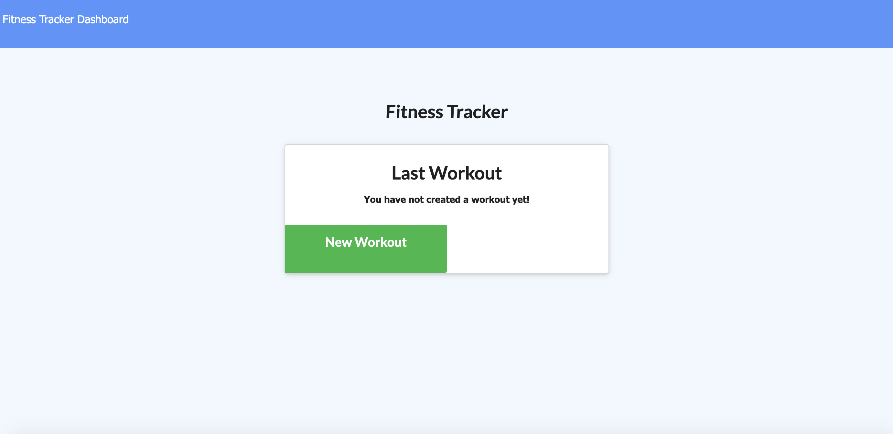

# swinstreamFitnessTracker

# The What!
H!  This is a great fitness tracker app.  You can use this app to track all of your fitness adventures.  Open the app to start a workout.  Once the workoug has been entered, you have the option to complete the workout, or continue it.  Continuing the workout will compile the totals of Weight, Sets, Reps Duration, and Distance.  Click on the Dashboard to have a visual representation of your workouts by day, up to the last 7 days!  

# The How?
This applicaiton uses Mongo Atlas to house data in the database.  The appliaiton uses Mongoose, Node, MongoDB and Express to Bootstrap to style.  The app is deployed on Heroku to funciton properly.  

# The Why?

For the fitness buffs who like to measure progress.  Hit the weights!  

# The Where?

Try the app out here!  https://swinstream-fitness-tracker.herokuapp.com/.

# The Who

This applicaiton is maintained by myself.  I can be reached for contributions, or questions here:

johnsondavid1107@gmail.com

